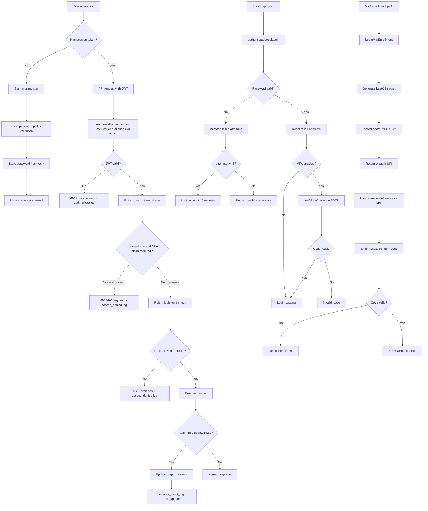

# Authentication and Authorization Flow (Defense)

## Mermaid Diagram

## Notes for Defense

1. Authentication proves identity: password hash verification + optional TOTP challenge.
2. Authorization enforces permissions: route-level role checks using requireRole middleware.
3. CID principles:

- Confidentiality: passwords hashed, MFA secret encrypted at rest.
- Integrity: append-only audit logs in database triggers.
- Availability: lockout is temporary and bounded, API remains available.

4. Least privilege:

- Auditor has read-only access where required.
- Admin is required for role assignment routes.
